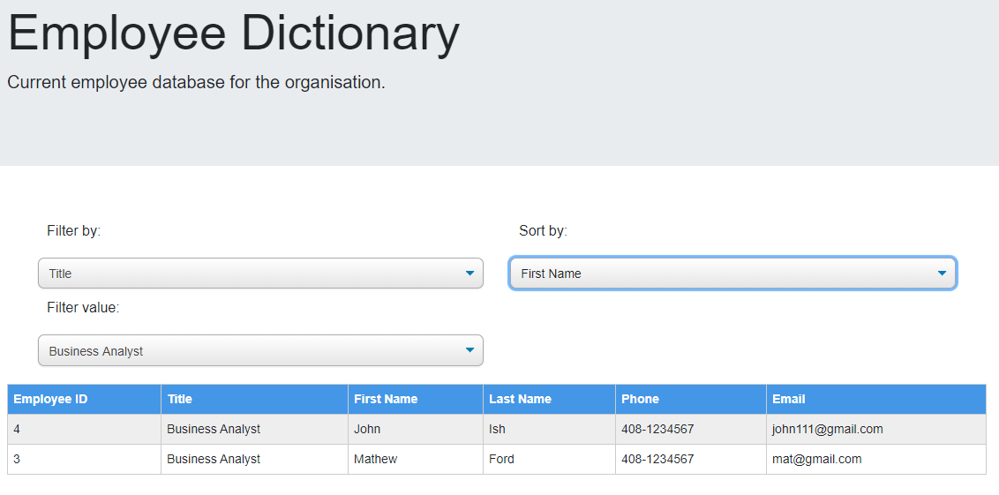
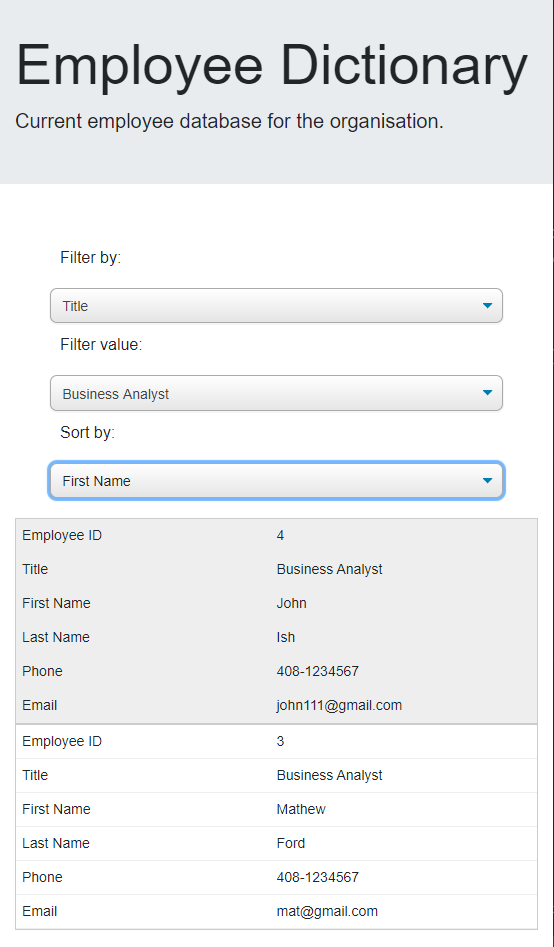

# Employee Directory

An application to view employee's non-sensitive data. It allows user to filter and sort existing employee's data from an existing database.

## User Story

- As a user, I want to be able to view my entire employee directory at once so that I have quick access to their information.

## Business Context

An employee or manager would benefit greatly from being able to view non-sensitive data about other employees. It would be particularly helpful to be able to filter employees by name.

## Technical details

User data in the current format can be added to data.json file, which acts as the database.

It has the following functionalities.

The user will be able to:

- Sort the table by selected column in the sort section

- Filter the table by selected column in the filter section
  - Based on filter value colum selection, table will show filtered section

## Technologies used

- React
- Node

# Links

## Repository

* Github

  > https://github.com/JameskuttySebastian/EmployeeDirectory

## Deployed Application URL

* Heroku
  > https://blueberry-custard-58021.herokuapp.com/

## Home Page



## Home Page



### Prerequisites

It needs node to run the application.

### Installing

After forking the repository, clone repository to local machine.

Run the following command in the root directory to install the dependencies.

```
npm install
```

And run following command in the root directory, the application will open in default browser.

```
npm start
```

## Running the tests

There are no automated tests for this application

## Deployment

Follow Heroku CLI (or specific to the deployment platform) standard deployment method to deploy the application.

## Built With

- [React](https://reactjs.org/) - The web framework used
- [npm](https://www.npmjs.com/) - Dependency Management

## Versioning

We use [Git](https://git-scm.com/) for versioning.